<!-- Generated by scripts/build.py — edit the CONFIG there, not this file. -->

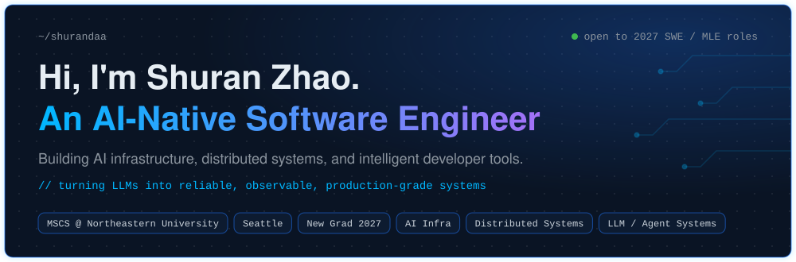

  

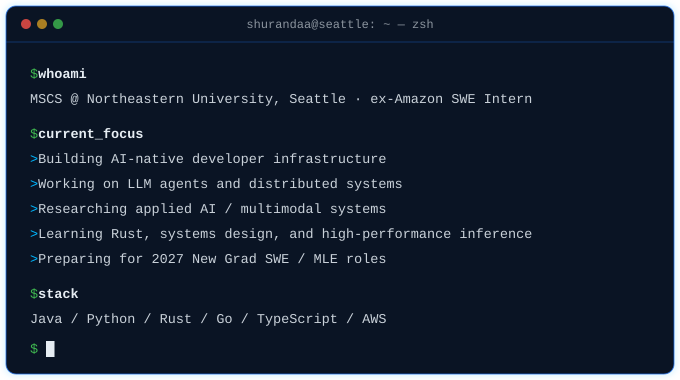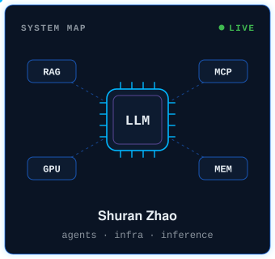

<a href="mailto:shuranz330@gmail.com">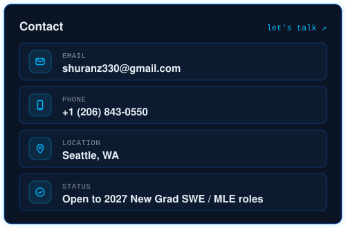</a>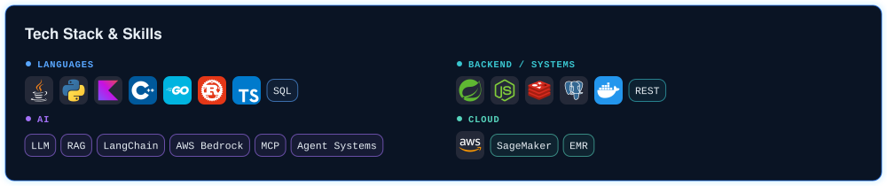

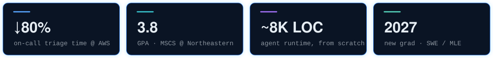

<a href="https://github.com/shurandaa/shurandaa/blob/main/projects/ai-oncall.md">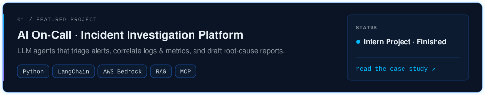</a>

<a href="https://github.com/TianWang0810/facial-dynamics/blob/main/README.md">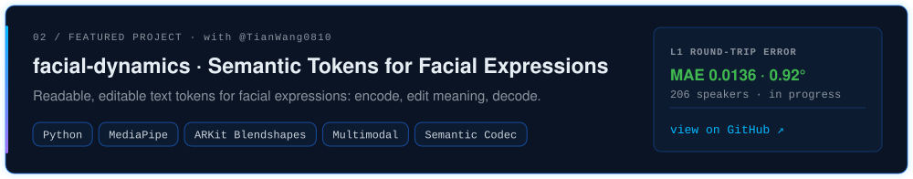</a>

<a href="https://github.com/shurandaa?tab=repositories">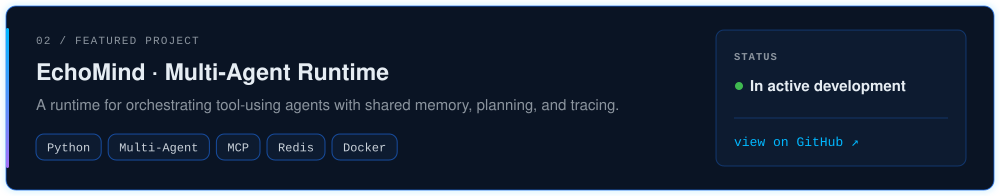</a>

<a href="https://github.com/shurandaa?tab=repositories">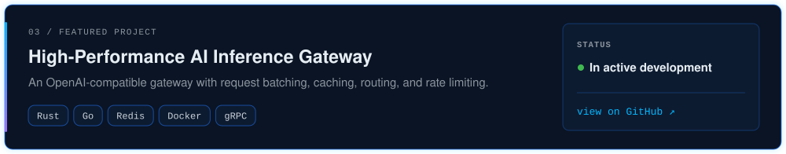</a>

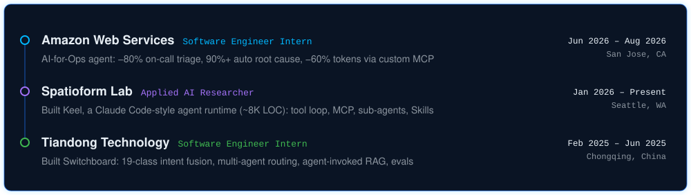

