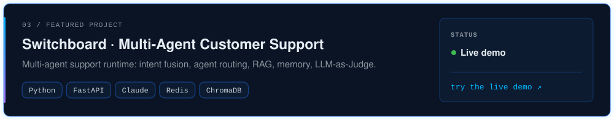
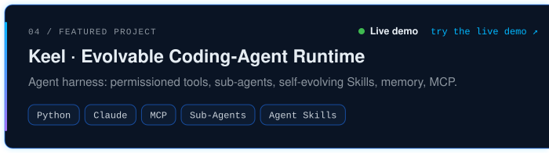
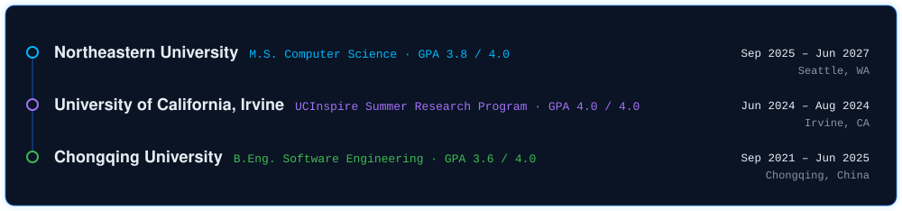

<!-- Generated by scripts/build.py — edit the CONFIG there, not this file. -->

<picture><source media="(prefers-color-scheme: light)" srcset="assets/header-light.svg" /></picture>

  <a href="https://www.linkedin.com/in/shuran-zhao-990030379/"><picture><source media="(prefers-color-scheme: light)" srcset="assets/cta-linkedin-light.svg" /></picture></a>
  <a href="mailto:shuranz330@gmail.com"><picture><source media="(prefers-color-scheme: light)" srcset="assets/cta-email-light.svg" /></picture></a>

<picture><source media="(prefers-color-scheme: light)" srcset="assets/current-focus-light.svg" /></picture><picture><source media="(prefers-color-scheme: light)" srcset="assets/mascot-light.svg" /></picture>

<a href="mailto:shuranz330@gmail.com"><picture><source media="(prefers-color-scheme: light)" srcset="assets/contact-light.svg" /></picture></a><picture><source media="(prefers-color-scheme: light)" srcset="assets/skills-light.svg" /></picture>

<picture><source media="(prefers-color-scheme: light)" srcset="assets/metrics-light.svg" /></picture>

<picture><source media="(prefers-color-scheme: light)" srcset="assets/section-projects-light.svg" /></picture>

<a href="https://github.com/shurandaa/shurandaa/blob/main/projects/ai-oncall.md"><picture><source media="(prefers-color-scheme: light)" srcset="assets/project-ai-oncall-light.svg" /></picture></a>

<a href="https://github.com/TianWang0810/facial-dynamics/blob/main/README.md"><picture><source media="(prefers-color-scheme: light)" srcset="assets/project-facial-dynamics-light.svg" /></picture></a>

<a href="https://54.209.58.120.sslip.io"><picture><source media="(prefers-color-scheme: light)" srcset="assets/project-switchboard-light.svg" /></picture></a>

<a href="https://keel.54.209.58.120.sslip.io"><picture><source media="(prefers-color-scheme: light)" srcset="assets/project-keel-light.svg" /></picture></a>

<picture><source media="(prefers-color-scheme: light)" srcset="assets/section-experience-light.svg" /></picture>

<picture><source media="(prefers-color-scheme: light)" srcset="assets/experience-light.svg" /></picture>

<picture><source media="(prefers-color-scheme: light)" srcset="assets/section-education-light.svg" /></picture>

<picture><source media="(prefers-color-scheme: light)" srcset="assets/education-light.svg" /></picture>

