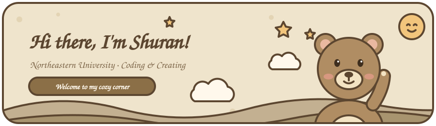
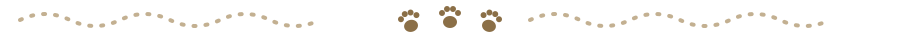

  

  

  

## 🧸 About Me

- 🎓 Student at **Northeastern University**
- 🔭 Currently working on **\<你的项目\>**
- 🌱 Learning **\<正在学的东西\>**
- 💬 Ask me about **\<擅长的话题\>**
- 🍪 Fun fact: **\<一个有趣的小事实\>**

## 🧺 Tech Stack

  
  
  
  
  
  

## 📮 Say Hi

  
  

  🐾 Thanks for stopping by — have a cozy day! 🐾

