

# AI On-Call · Incident Investigation Platform

**Intern project @ Amazon Web Services** · Software Engineer Intern · Jun – Aug 2026 · ✅ Finished

<code>AWS Bedrock</code> <code>MCP</code> <code>AWS CDK</code> <code>Slack</code> <code>Playwright</code> <code>LLM Agents</code>

Internal project — source code is not public. Details are described at the architecture level only.

---

## TL;DR

An AI-for-Ops system that automatically investigates **deployment failures, integration-test failures, and canary alarms** end to end — from the moment a pipeline breaks to a root-cause summary in Slack and a ticket that opens and closes itself.

| Result | Impact |
|---|---|
| ⏱️ Manual on-call triage time | **↓ 80%+** across 4 on-call rotations |
| 🔍 Incidents with automatic root cause | **90%+** — no manual RCA needed |
| 🎫 Manual ticket handling (routine failures) | **↓ 95%** |
| 🪙 Tokens per investigation (custom MCP server) | **↓ 60%** |
| 🧑‍💻 New-engineer on-call ramp-up time | **↓ 80%** |
| 📊 Automated weekly reporting | **30+ engineers** |
| 🔁 Self-evolving | Weekly evaluation · memory & skill updates · engineer-run rollback on regression |

---

## The Problem

On-call engineers were spending most of each shift on repetitive detective work:

- A pipeline stage fails or a canary alarm fires → someone has to open the pipeline, find the failing step, dig through logs, metrics, and recent deployments, and decide whether it's a real regression, a flaky test, or an infra blip.
- Each failure type needs a **different** investigation path and **different** data sources, and that knowledge lived mostly in senior engineers' heads.
- Tickets for routine failures were created, updated, and closed by hand, even when the pipeline had already recovered.
- New engineers joining the rotation needed weeks to build that intuition.

## The Solution at a Glance

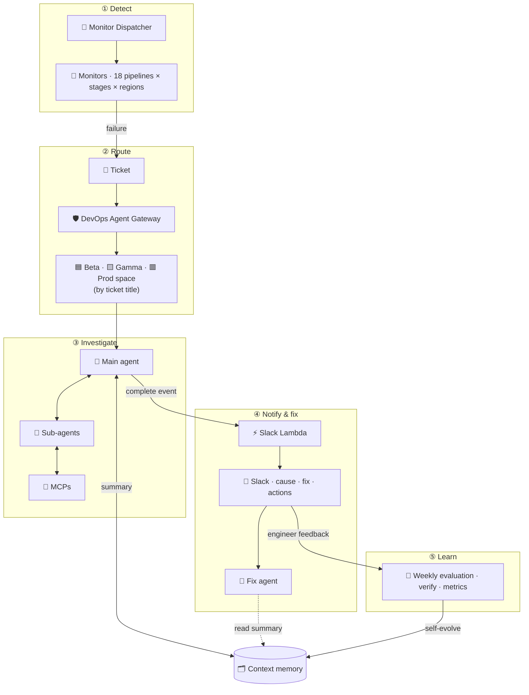

Each phase is expanded in the sections below: ① §1 · ② §2 · ③ §3–4 · ④ §5–6, §8 · ⑤ §7

---

## Components

### 1 · Monitor Dispatcher — one monitor per pipeline × stage × region

The system covers **18 CI/CD pipelines**, and none of them look alike: each pipeline has its **own set of stages** (Beta → Gamma → Prod), and each stage deploys to its **own set of regions**. A failure in one region of one stage is a different problem from the same failure elsewhere, so every **pipeline × stage × region** gets its **own monitor**.

Maintaining that by hand doesn't scale, so I built a **Monitor Dispatcher** that automatically **detects each pipeline's structure** and **registers the monitors** it needs.

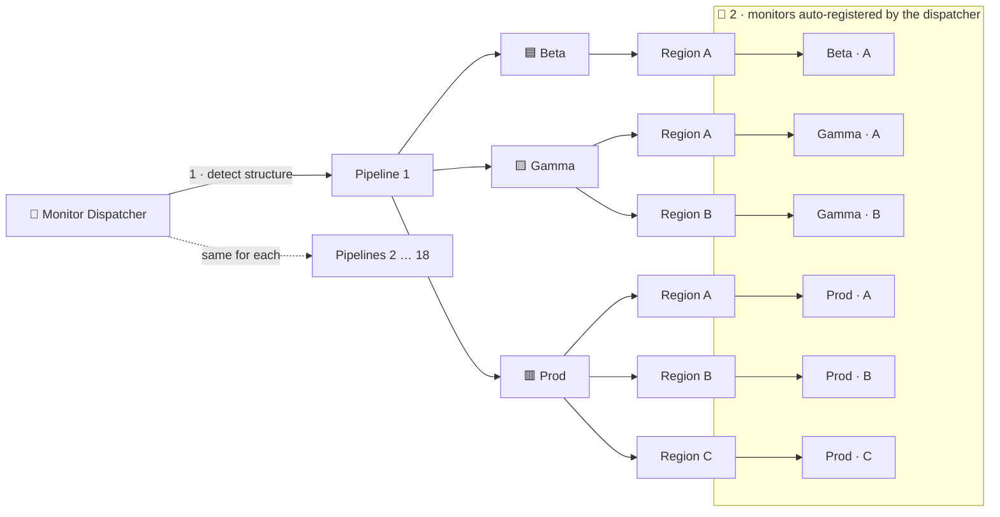

Illustrative: the stages and regions per pipeline vary — the dispatcher reads them from each pipeline rather than hard-coding them.

- **Zero manual setup:** onboarding a pipeline, adding a stage, or expanding to a new region doesn't require anyone to hand-write a monitor.
- **Precise signals:** because each monitor is scoped to a single pipeline × stage × region, a failure maps directly to *where* it happened — which is exactly what the investigation needs next.
- A failure that trips a monitor **auto-creates a ticket**; everything else is filtered out before anyone is paged.

### 2 · DevOps Agent Gateway & stage routing

Once a ticket is opened, the **DevOps Agent Gateway** picks it up and starts the investigation. The first decision is *which stage failed*: the gateway reads the **ticket title** and routes the investigation into a dedicated **stage space** — **Beta**, **Gamma**, or **Prod** — each with its own context, data sources, and investigation playbook.

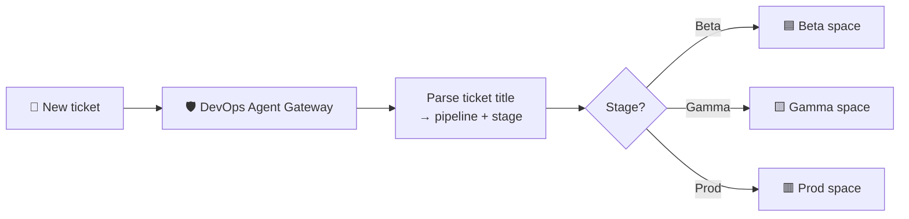

Routing on the title up front keeps each investigation focused: the agent only loads the tools and context relevant to that stage, instead of searching every environment.

### 3 · Agent runtime — main agent + sub-agents

Inside a stage space, the investigation runs on an **agent runtime** with two roles:

- **🧠 Main agent** — owns the **investigation workflow**: decides **when to spawn sub-agents**, what each one should look into, and **when the investigation is complete**.
- **🔎 Sub-agents** — do the legwork: **gather information** and return a **preliminary judgment** on their slice of the problem.

Both roles follow the **SOP**, and both are specialized per **failure type**: each failure type has its own **main-agent skill** and its own **sub-agent skills**. Every result — sub-agent findings and the final conclusion — is written to **context memory**.

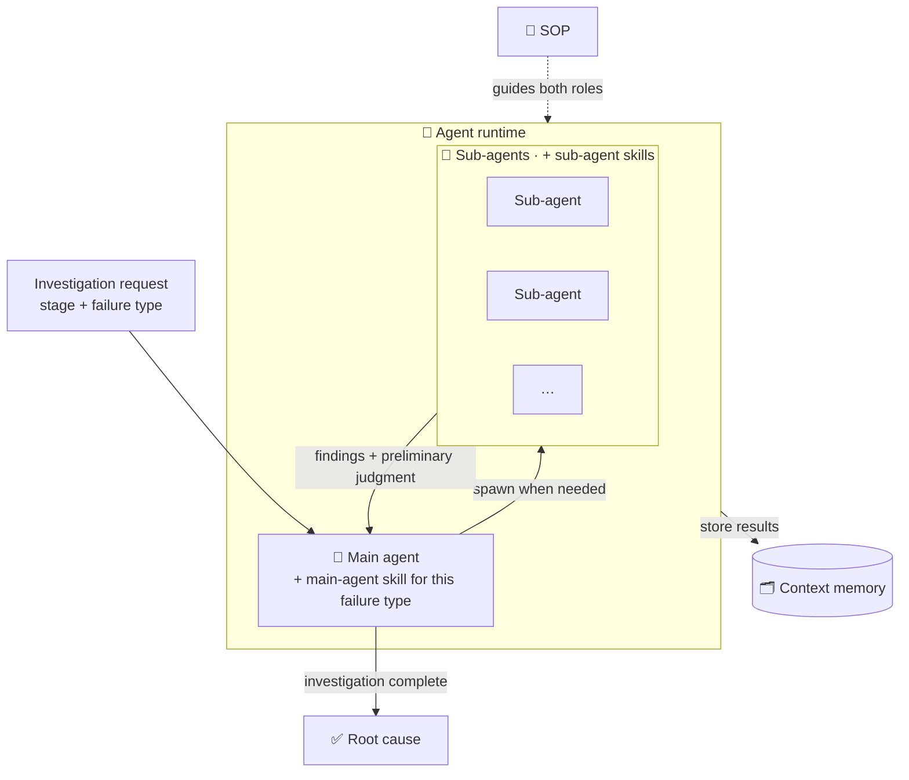

| | 🧠 Main agent | 🔎 Sub-agents |
|---|---|---|
| **Responsible for** | Maintaining the investigation workflow · deciding when to spawn sub-agents · deciding when the investigation is done | Information gathering · preliminary judgment |
| **Guided by** | SOP | SOP |
| **Specialized by** | Main-agent skill per failure type | Sub-agent skills per failure type |
| **Writes to** | Context memory | Context memory |

**The investigation loop**

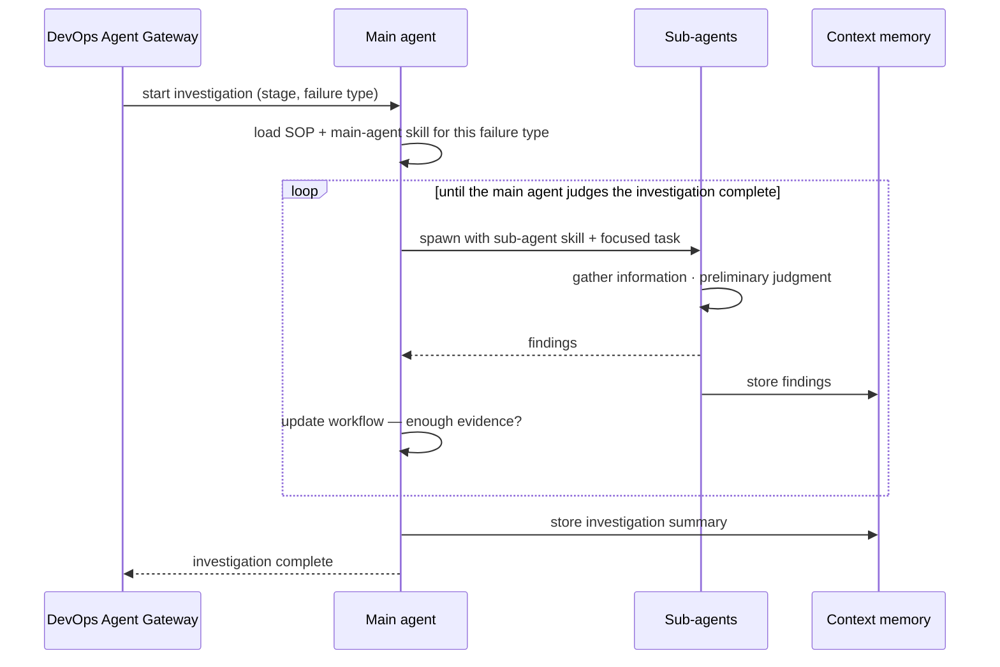

**Skills by failure type** (illustrative)

| Failure type | Main-agent skill | Sub-agent skills |
|---|---|---|
| 🚀 Deployment | Drive a rollout investigation: which stage/region, what changed, is it spreading | Deployment diff · service log search · rollout / rollback status |
| 🧪 Integration test | Separate real regressions from flaky tests & environment issues | Test-report analysis · test-failure history · recent commit diff |
| 🐤 Canary | Correlate the alarm window with changes & dependencies | Metric correlation · dependency health · recent deployments |

### 4 · MCP layer — 2 custom MCP servers + internal MCPs

The agents reach every external system through **MCP**. I built **two custom MCP servers**; the rest of the data comes from existing internal MCP servers.

| MCP server | Called by | When | Returns |
|---|---|---|---|
| 🔐 **Pipeline & agent-space permission config** (custom) | 🧠 Main agent | **Before** any sub-agent starts investigating | Pipeline configuration + the DevOps Agent space permission setup the investigation runs under |
| 🧪 **Test CR** (custom) | 🔎 Sub-agent | While investigating test failures | **Structured test-report analysis** — used to decide whether a new test is needed |
| 🏢 **Internal MCPs** — ticketing, pipeline, and others | 🔎 Sub-agents | Throughout the investigation | Ticket, pipeline, and other operational data |

Internal MCP servers are described at a high level only (confidential).

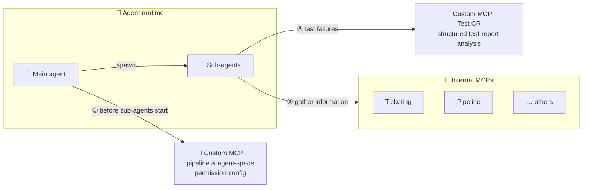

**Order matters:** the main agent fetches the pipeline and permission configuration **first**, so every sub-agent it spawns starts with the right pipeline context and access scope instead of discovering it on its own.

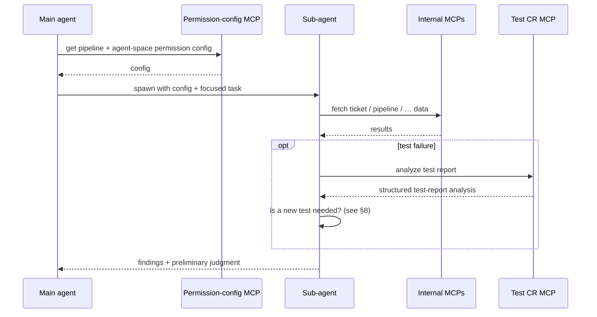

### 5 · Investigation summary → Slack → one-click fix

The agent doesn't post to Slack directly. When the investigation is complete, the main agent **writes an investigation summary** and emits an **investigation-complete event**. A **custom Slack Lambda** picks up the event, **fetches the summary with SigV4-signed requests**, and renders it into an actionable Slack message.

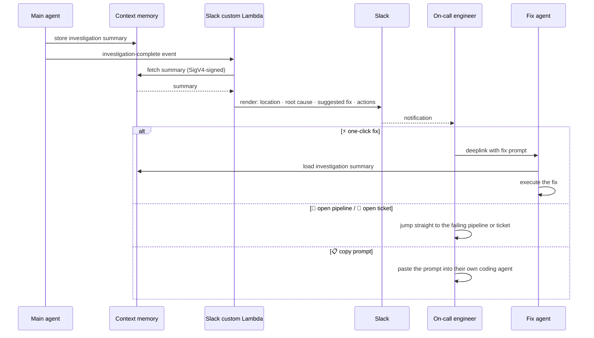

**What the Slack message contains**

> **🔴 Investigation complete** · `<pipeline>` · Prod · `<region>`
>
> **📍 Failure location** — the pipeline, stage, region, and step that failed 
> **🧭 Root cause** — what went wrong, backed by the evidence the sub-agents collected 
> **🛠️ Suggested fix** — the recommended remediation
>
> `⚡ One-click fix` &nbsp; `🚦 Open pipeline` &nbsp; `🎫 Open ticket`
>
> **📋 Prompt for engineers** — a ready-to-paste prompt with the full investigation context

| Action | What happens |
|---|---|
| ⚡ **One-click fix** | Sends a prompt via **deeplink** to the **fix agent**, which loads the **investigation summary from memory** and executes the fix |
| 🚦 **Open pipeline** | Jumps straight to the failing pipeline |
| 🎫 **Open ticket** | Jumps straight to the ticket |
| 📋 **Copy prompt** | Engineers can paste the prompt into their own coding agent to fix it themselves |

**Why this design:**
- **Decoupled:** the agent runtime only emits an event; rendering and Slack delivery live in the Lambda, so either side can change independently.
- **Secure:** the Lambda pulls the summary with **SigV4** instead of the summary being pushed around in the message payload.
- **From diagnosis to fix in one click:** the fix agent reuses the investigation summary from memory, so nothing is re-investigated.

**Real-time dashboard:** open failures and their diagnosed root causes, in one view. For **90%+ of incidents**, on-call no longer had to investigate manually at all.

### 6 · Ticket lifecycle — the ticket is state + record, not a to-do

Engineers **only fix problems — they never operate tickets**. The ticket is an **intermediate state and a recorder**: it carries a failure from the monitor to the agent, and keeps the record the weekly evaluation (§7) later reviews.

- **Open:** a monitor fires → a ticket is **auto-created**.
- **Investigate:** the DevOps Agent Gateway picks it up and the investigation is recorded against it.
- **Close:** a **polling job** periodically sweeps all open tickets and **closes any whose alarm has cleared** — whether the failure was fixed or turned out to be a false positive.

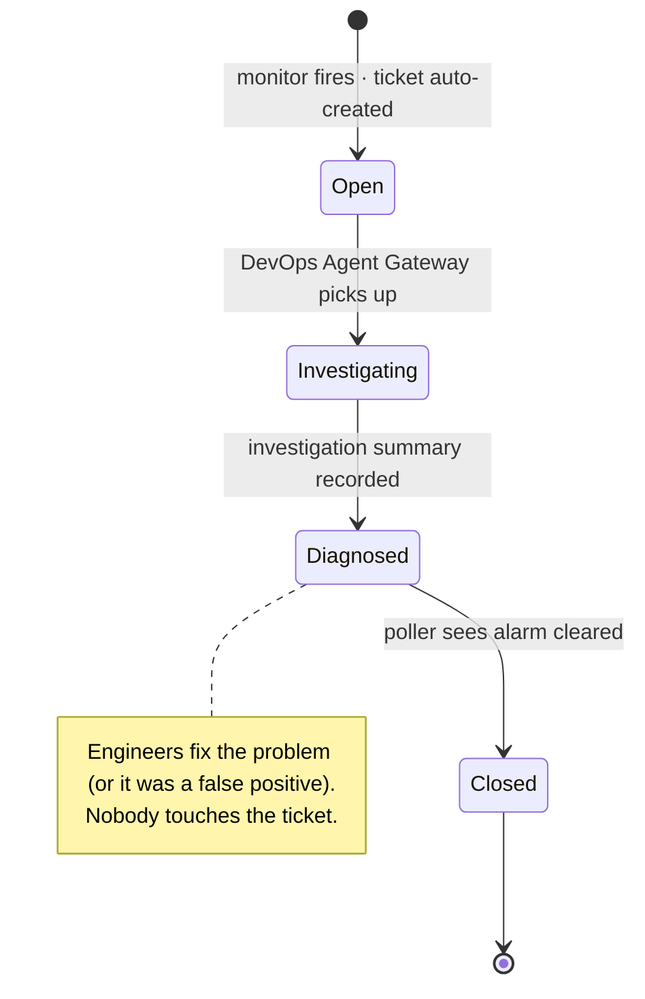

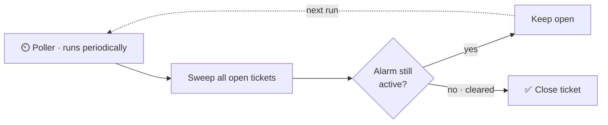

| Who | Does what with the ticket |
|---|---|
| 📡 Monitor | Creates it |
| 🛡️ Gateway + 🤖 agents | Pick it up and record the investigation |
| 👩‍💻 Engineers | **Nothing** — they fix the problem, not the ticket |
| ⏲️ Poller | Closes it once the alarm clears |
| 🔁 Weekly evaluation | Reads it as the record of what happened |

Result: **95% less manual ticket handling** for routine failures.

### 7 · Weekly evaluation loop — a self-evolving agent

The system doesn't just investigate — it **grades itself every week**, learns from its mistakes, and **rolls back changes that didn't help**.

**Per failure:** the agent's verdict includes whether the failure is a **false positive / flake**. For every Slack notification, the on-call engineer decides whether to fix it. Real failures get fixed (one-click fix or by hand); false positives don't.

**Engineer feedback:** engineers report back through a **form that is filed as a ticket under a dedicated CTI** (Category / Type / Item), which routes it straight to the agent — e.g. "this verdict was a false positive" or "the root cause was wrong, here's the real one".

**Weekly:** fix results and feedback tickets are rolled up into the **DevOps Agent space**, which runs a weekly check over every ticket it investigated that week.

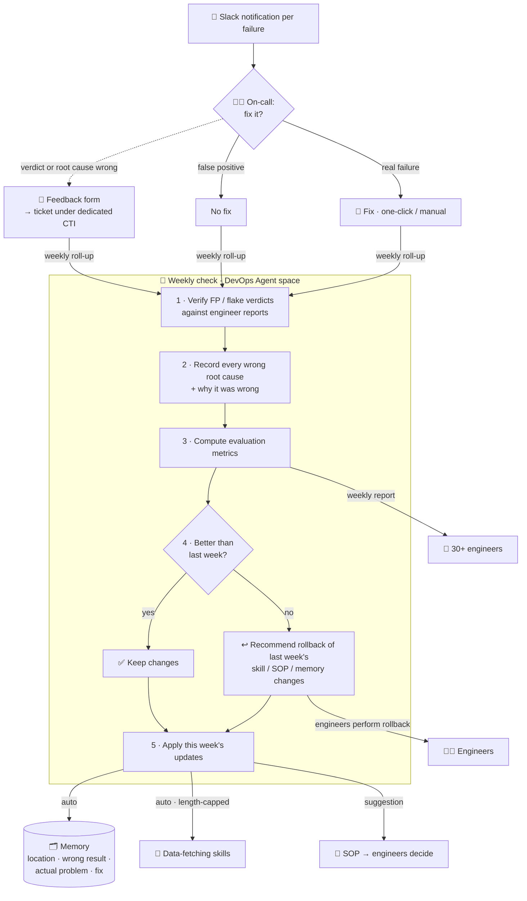

**What the weekly evaluation computes**

| Metric | What it tells us |
|---|---|
| ❌ **Investigation error rate** + **error causes** | How often the root cause was wrong — and *why* |
| 🎯 **False-positive / flake accuracy** + **misjudgment causes** | Whether the agent correctly separates real failures from noise |
| ⏱️ **Engineer time saved** (this week) | Average manual triage time × investigations automated |
| 🪙 **Token usage** (this week) + **per-investigation token usage** | Cost, and whether investigations are getting more efficient |

**Regression guard:** the metrics are compared with the previous week. If last week's changes to **skills, SOPs, or memory** didn't improve the results, the agent **recommends a rollback** — and **engineers perform every rollback**, so the agent can't drift into getting worse on its own.

**How each kind of knowledge evolves**

| What | Who changes it | How |
|---|---|---|
| 🗂️ **Memory** | Agent · automatic | Each mistake becomes an entry: **error location + wrong result + actual problem + fix** |
| 🧩 **Data-fetching skills** | Agent · automatic, bounded | The agent may tune some data-fetching skills itself, **never beyond a fixed length limit** |
| 📘 **SOPs** | Engineers | The weekly agent **suggests** SOP changes; engineers decide and apply them |

Guardrails: SOPs stay human-owned, self-edited skills are length-capped, and every rollback is performed by an engineer.

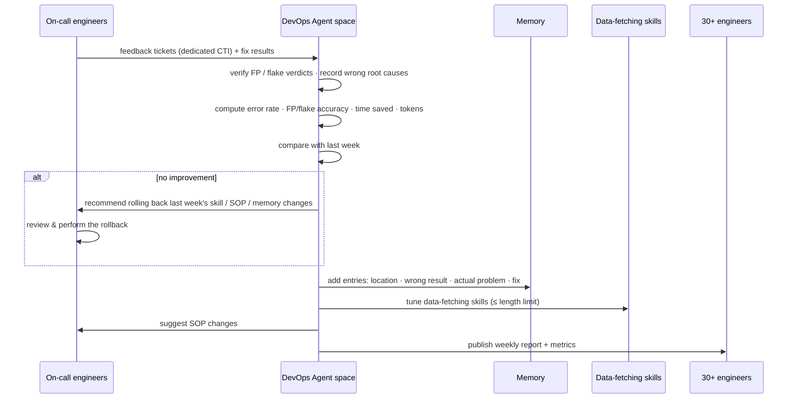

Together with the SOPs, this loop cut **new-engineer on-call ramp-up time by 80%** and automated weekly reporting for **30+ engineers**.

Actual metric values are confidential and not shown.

### 8 · Automated test generation → CR → Slack review

When an investigation involves a test failure, the sub-agent can close the loop by **proposing a new test** — without an engineer writing it by hand.

1. The sub-agent calls the **Test CR MCP**, which returns a **structured analysis of the test report**.
2. The **sub-agent decides** whether a new test is needed.
3. If yes, it hands off via a **deeplink** to **Agent Spaces** — a separate internal service (not one of our DevOps Agent stage spaces).
4. Agent Spaces **generates the test** and opens a **CR** (code review).
5. The CR is sent to **Slack for review** — a human always approves before anything merges.

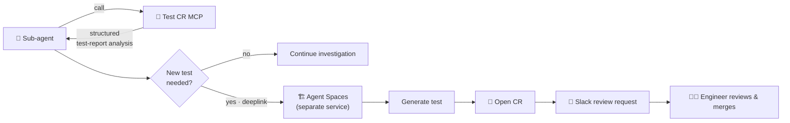

---

## End-to-End Example: a Canary Alarm

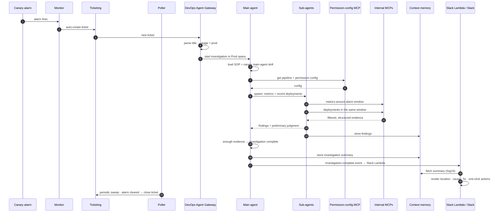

---

## Tech Stack

| Area | Technologies |
|---|---|
| AI / Agents | AWS Bedrock, main-agent / sub-agent runtime, SOP-guided skills, context memory |
| MCP | 2 custom MCP servers (permission config, Test CR) + internal MCP servers |
| Infrastructure | AWS CDK, CI/CD pipelines, monitors & alarms |
| Integrations | Slack custom Lambda (SigV4), deeplinks → fix agent, ticketing system, real-time dashboard, Agent Spaces (test generation → CR) |
| Testing | Playwright |

## My Role

- Designed the end-to-end investigation workflow and authored the SOPs and per-failure-type main-agent / sub-agent skills.
- Built the two custom MCP servers (permission config, Test CR), the Slack/dashboard integration, the ticket lifecycle automation (auto-create + polling auto-close), the weekly evaluation loop, and the test-generation → CR workflow.

---

← <a href="https://github.com/shurandaa">Back to profile</a>

