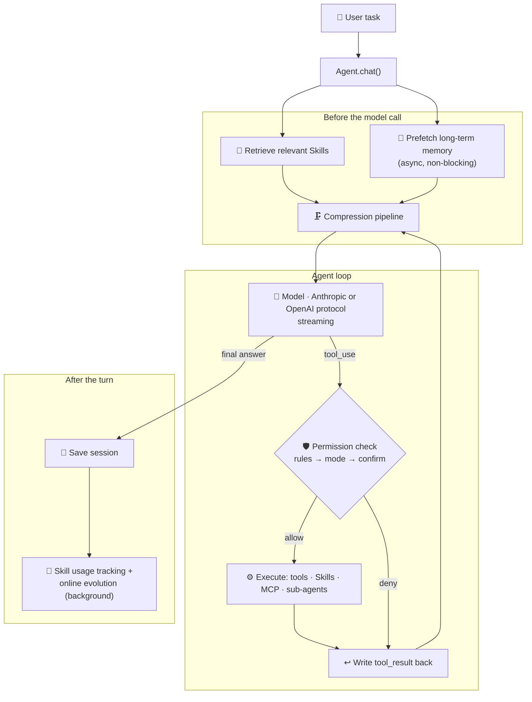
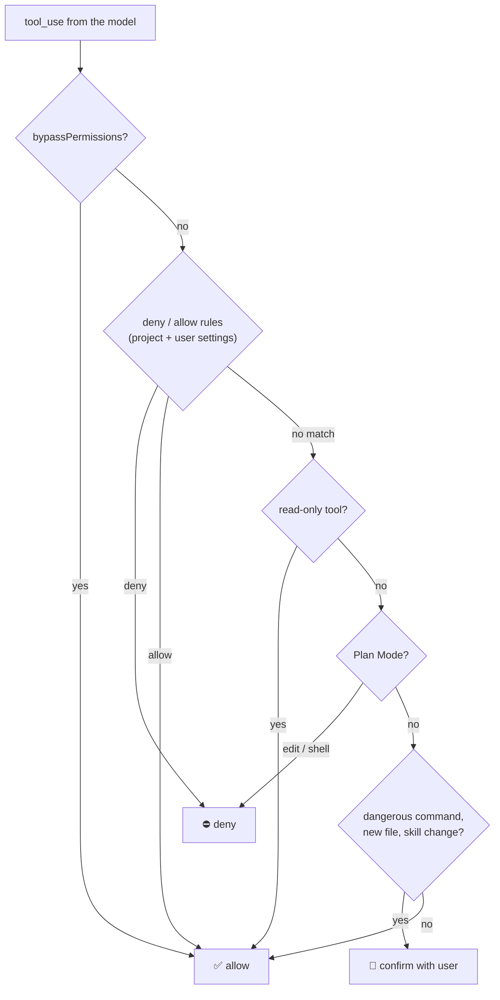
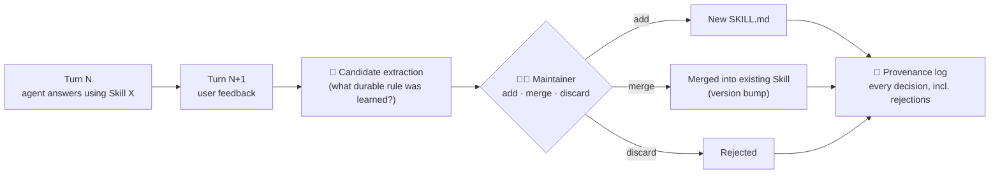
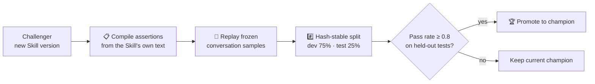
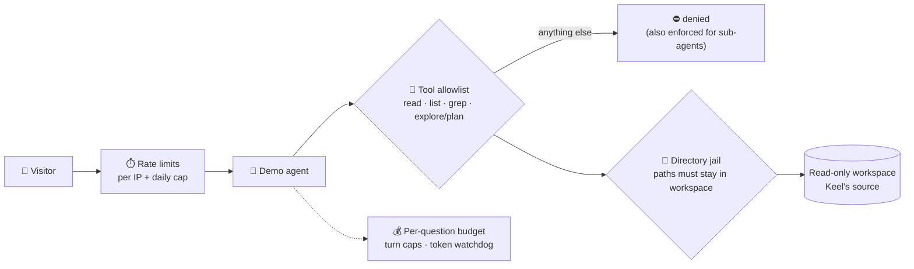

# Keel · Evolvable Coding-Agent Runtime

**A Claude Code-style agent harness in ~8K lines of Python, with no agent framework: safety enforced by the runtime, and Skills that improve themselves**

<code>Python</code> <code>Anthropic + OpenAI protocols</code> <code>MCP (JSON-RPC)</code> <code>Sub-agents</code> <code>Agent Skills</code> <code>FastAPI · SSE</code>

### [▶ Try the live demo](https://keel.54.209.58.120.sslip.io)

Built as an Applied AI Researcher at Spatioform Lab (Jan 2026 – present). Source available on request.

---

## TL;DR

Keel's thesis is that **the harness matters more than the prompt**. The model only *proposes* actions. The runtime decides what's allowed, executes it, writes results back, compacts context and keeps what was learned.

| | |
|---|---|
| 🔁 **Agent loop** | Full tool-call loop over **Anthropic and OpenAI** protocols, with streaming and early tool execution |
| 🛡️ **Runtime safety** | Plan Mode hard-blocks writes and shell; edits require a prior read with mtime revalidation; deny/allow rules resolve before permission mode |
| 🔌 **MCP** | Self-written stdio **JSON-RPC** MCP client, with external tools mounted as `mcp__server__tool` |
| 🤖 **Sub-agents** | Isolated-context `explore` / `plan` / `general` agents, plus custom ones defined in Markdown |
| 🧬 **Self-evolving Skills** | The next user turn is the supervision signal; a maintainer decides add / merge / discard, with provenance |
| 🏆 **Skill evaluation** | Champion–challenger pipeline: assertions compiled from the Skill's own text, frozen replays, hash-stable splits |
| 🗜️ **Memory folding** | Long sessions fold into a typed episode / working / tool schema, not a prose summary |

---

## Why build a runtime instead of using a framework

Frameworks hide exactly the parts that decide whether an agent is trustworthy: **when a tool may run, what happens to its output, and how the agent learns**. Writing the harness from scratch made each of those an explicit, testable decision instead of a framework default.

## Architecture at a Glance

---

## Components

### 1 · The agent loop

- **Two protocols, one loop.** The same runtime speaks Anthropic-compatible and OpenAI-compatible APIs, picked from the endpoint configuration.
- **Early execution.** While the response is still streaming, any tool that is safe to run concurrently (read, list, grep) and already allowed starts as soon as its `tool_use` block is complete. This removes the idle gap before the full response arrives.
- **Budgets.** Turn limits and cost limits are checked between tool rounds. When a limit is hit, the remaining tool calls get explicit "skipped" results, so the transcript stays valid.

### 2 · Safety in the runtime, not the prompt

Prompts can be ignored. Runtime checks can't. Every tool call is resolved through the same ordered decision:

Edits also have to pass a freshness check: **a file must have been read before it can be edited**, and if its mtime has changed since that read, the edit is refused until the agent reads it again. This stops the agent from overwriting changes it never saw.

### 3 · Self-written MCP client

Keel talks to external MCP servers over **stdio JSON-RPC** with its own client, with no SDK. Discovered tools are namespaced as `mcp__<server>__<tool>` and go through the same permission and execution path as built-in tools.

### 4 · Sub-agents with isolated context

The main agent can delegate a task to a sub-agent. The sub-agent gets its own message history, its own tool set and its own system prompt, and returns only its findings, which keeps the parent's context small.

| Type | Tools | Use |
|---|---|---|
| `explore` | read / list / grep | Find and understand code |
| `plan` | read / list / grep | Structured implementation plans |
| `general` | everything except `agent` | Independent end-to-end tasks |
| custom | declared in Markdown front-matter | Domain-specific agents |

### 5 · Self-evolving Skills

Skills are reusable methods stored as `SKILL.md` files. Keel improves them from real usage and uses **the user's next turn as the supervision signal**, since that turn confirms, rejects or refines what the agent just did.

Extraction and maintenance are split into separate steps on purpose. The extractor proposes rules, and a separate maintainer decides whether each one deserves to exist. It prefers merging over adding, and discards duplicates, so the Skill library doesn't bloat.

### 6 · Champion–challenger Skill evaluation

A Skill edit only goes live after it proves itself:

- Assertions are **compiled from what the Skill itself claims** (for example "conclusion first" or "cite sources"), so each Skill is tested against its own promises.
- The dev/test split is **hash-stable**: a given sample always falls in the same split, so the comparison can't be gamed by reshuffling.

### 7 · Memory: folding + long-term

- **Session folding.** When context runs out, the conversation is folded into a **typed schema** instead of a prose summary:
  - `episode_memory`: goals and what happened
  - `working_memory`: current state and next concrete actions
  - `tool_memory`: effective tool parameters, response patterns and past errors, plus the rules derived from them

  This keeps long tasks on track after compaction.
- **Tiered compaction** before full folding: tool-result budgeting, snipping stale results, and clearing old results when the session has been idle.
- **Long-term memory**, isolated per project by a hash of the working directory. It stores user preferences, project background, decisions and references, and is prefetched asynchronously so the model call isn't blocked.

---

## Design Decisions

| Decision | Why |
|---|---|
| No agent framework | The trust-critical parts (permissions, tool results, learning) should be explicit code, not defaults |
| Safety checks in the runtime | A model can be talked out of a prompt rule; it can't talk its way past a denied tool call |
| Read-before-edit + mtime check | Prevents blind overwrites of files the agent never saw or that changed underneath it |
| Next-turn supervision for Skills | The user's reaction is the cheapest reliable label for whether a behavior was right |
| Separate extractor and maintainer | Proposing and accepting rules are different jobs; splitting them keeps the library small and auditable |
| Typed memory folding | Structured state survives compaction far better than a paragraph of summary |

---

## Public Demo

The [live demo](https://keel.54.209.58.120.sslip.io) lets visitors ask Keel about **its own source code**. It streams every tool call and sub-agent into a live trace panel. Because Keel can run shell commands and edit files, the demo is sandboxed in layers:

- Memory, session saving, Skill evolution and MCP are **disabled** in the demo.
- The container runs with a read-only filesystem, drops all Linux capabilities, and runs as a non-root user with memory and process limits.
- If the budget runs out mid-investigation, the agent is forced to answer from what it has already read.

## Tech Stack

| Area | Technologies |
|---|---|
| Runtime | Python 3.12, asyncio, Anthropic + OpenAI SDKs |
| Protocols | MCP over stdio JSON-RPC (self-written client) |
| Demo | FastAPI, Server-Sent Events, vanilla JS |
| Deployment | Docker (hardened), Caddy (auto-HTTPS), AWS Lightsail |

---

Source code is private. Available on request for interviews. ← <a href="https://github.com/shurandaa">Back to profile</a>

