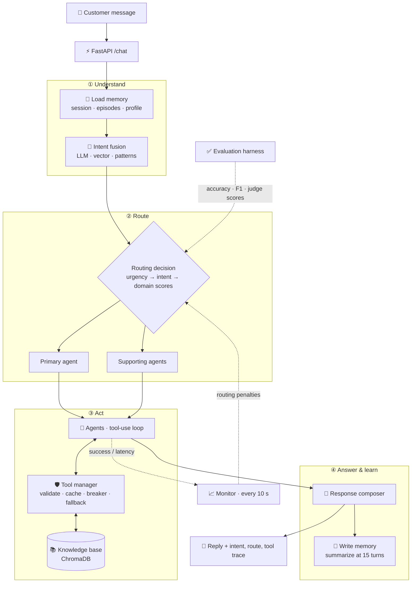
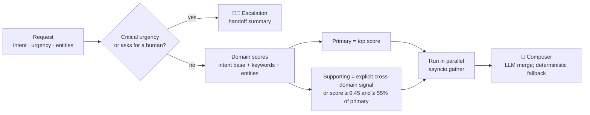
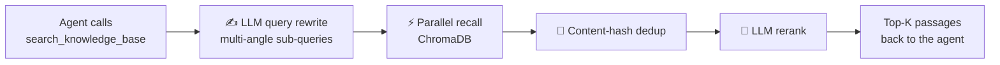
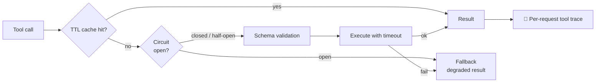
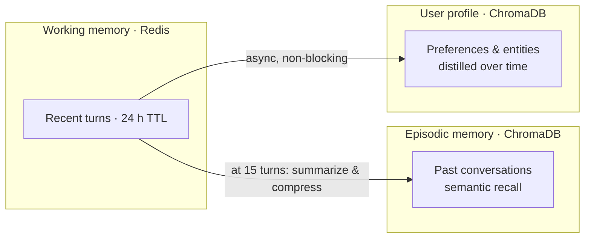
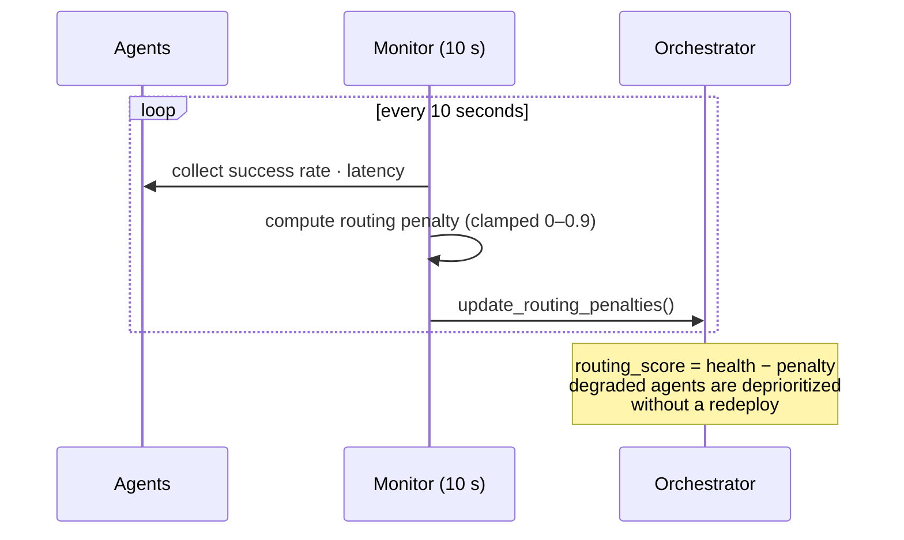

# Switchboard · Multi-Agent Customer Support Runtime

**Observable, evaluable, self-correcting multi-agent support: from intent to answer, with every decision traced**

<code>Python</code> <code>FastAPI · asyncio</code> <code>Claude</code> <code>Redis</code> <code>ChromaDB</code> <code>Prometheus</code> <code>Vue 3</code>

### [▶ Try the live demo](https://54.209.58.120.sslip.io)

Built as a Software Engineer Intern at Tiandong Technology (Feb – Jun 2025). Source available on request.

---

## TL;DR

Switchboard is not a chatbot wrapper. It is a runtime that closes the loop between **understanding a request, routing it to the right specialist agents, calling tools safely, remembering context, monitoring itself, and grading its own answers**.

| Area | What it does |
|---|---|
| 🎯 **Intent** | 19 intent classes from a 3-way fusion: LLM + vector similarity + keyword patterns |
| 🔀 **Routing** | Contract-scoped primary and supporting agents, run in parallel and merged |
| 📚 **RAG** | Agent-invoked retrieval: query rewriting, parallel recall, dedup, rerank |
| 🛡️ **Tool reliability** | Schema validation, TTL cache, timeouts, circuit breakers, fallbacks, per-request traces |
| 🧠 **Memory** | 3 tiers: Redis session context, ChromaDB episodic recall, ChromaDB user profiles |
| 📈 **Self-correction** | A 10 s monitor turns live success/latency into routing penalties, no redeploy |
| ✅ **Evaluation** | Intent Accuracy / Macro-F1 + LLM-as-Judge on 4 dimensions, with regression flags |

---

## The Problem

Customer-support bots usually fail in the same few ways:

- **One prompt does everything.** Billing, technical and account questions get the same generic answer.
- **Retrieval runs on every turn.** Irrelevant documents get injected, which makes answers worse.
- **Tools fail silently.** A slow or broken dependency drags down every conversation.
- **No one knows it's getting worse.** Without evaluation there's no way to tell whether a change helped.

## Architecture at a Glance

---

## Components

### 1 · Three-way intent fusion

Every message is classified into one of **19 intents**, including 9 fine-grained ones such as refund, invoice, technical_login and order_status. Three recognizers run concurrently and vote:

| Recognizer | Weight | Why it's there |
|---|---|---|
| 🧠 LLM with few-shot examples and the last 3 turns | 0.7 | Understands phrasing and context |
| 📐 Vector similarity to intent templates | 0.2 | Stable and cheap; catches paraphrases |
| 🔤 Keyword / pattern tables | 0.1 | Zero latency; precise signals like "charged twice" |

- **Graceful degradation:** if the LLM call fails, the vote falls back to vectors, then patterns.
- **Refinement rule:** when the LLM picks a broad intent but patterns confidently hit a fine-grained one, the fine-grained intent wins.
- **Low confidence → clarify:** below the threshold, the system asks a clarifying question instead of guessing.
- **Entity extraction:** order IDs, dates, amounts and error codes are pulled out by regex, so there is no extra LLM call.

### 2 · Contract-scoped multi-agent routing

There are four agents: **General, Technical, Billing and Escalation**. What makes them different is more than the prompt. Each agent has a **structured contract** covering its role, mission, workflow, input and output contracts, handoff conditions, the tools it may use, and its own model settings.

**Example:** "My invoice is wrong *and* the API keeps timing out" routes to **Billing as primary, with Technical as supporting**. Both run in parallel and the composer merges their answers into a single reply.

### 3 · Agent-invoked RAG

Retrieval is a **tool the agent chooses to call**, not something injected on every turn. A greeting or "talk to a human" never touches the knowledge base.

### 4 · Tool reliability layer

Every tool call goes through the same pipeline, so a single misbehaving dependency can't take down the conversation:

- **Circuit breaker:** CLOSED → OPEN → HALF_OPEN → CLOSED. It opens after repeated failures and probes before recovering.
- **Tool whitelist:** agents only get tools that give advice or check things, such as error-code lookups and billing-field checks. They never get tools that fake real business actions, like issuing refunds.
- **Tool traces:** every tool call is recorded against its request ID, and the whole request can be replayed through `/trace/tool/{request_id}`.

### 5 · Three-tier memory

- Context stays bounded: at 15 turns, working memory is summarized and compressed.
- Profile updates run **asynchronously**, so they never add latency to the reply.
- **Hot-reloadable Skills** (billing, technical, general) inject agent-specific business rules without a restart.

### 6 · Self-correcting routing

A background monitor samples every agent **every 10 seconds** and writes live health back into routing:

Metrics are also exported to **Prometheus** for dashboards and alerts.

### 7 · Evaluation harness

A single API endpoint (`/eval/run`) runs a repeatable evaluation:

| What | How |
|---|---|
| 🎯 Intent quality | Accuracy and **Macro-F1** on labeled cases |
| ⚖️ Answer quality | **LLM-as-Judge** on relevance, accuracy, completeness, helpfulness |
| 📉 Regressions | Results are compared with a persisted baseline, and any metric that got worse is flagged |

---

## Design Decisions

| Decision | Why |
|---|---|
| Fuse three recognizers instead of trusting the LLM alone | The LLM is best at meaning but costs latency and can fail. Vectors and patterns are cheap, deterministic backstops. |
| Contract-scoped agents, not persona prompts | Tool scopes and handoff rules are enforced by structure, so an agent can't drift outside its domain. |
| Retrieval as a tool, not a default | Skipping RAG when it isn't needed cuts noise and tokens. |
| Deterministic fallbacks everywhere | If the composer's LLM call fails, it still returns a readable merged answer, and a failed tool still returns a degraded result. |
| Monitor → routing penalties | The system adapts to degraded agents at runtime instead of waiting for a human and a redeploy. |

---

## Public Demo

The [live demo](https://54.209.58.120.sslip.io) runs the real system with the English, US-market knowledge base. It's safe to leave on the public internet:

- **Per-IP rate limit + daily cap**, backed by Redis
- **Admin-only endpoints:** knowledge-base writes and full evaluation runs need a token
- Only the HTTPS proxy is public. Redis and ChromaDB are reachable only inside the Docker network.
- **Claude Haiku 4.5** for fast, low-cost answers

Try the four built-in examples to see single-agent routing, tool use, multi-agent collaboration, and human escalation.

## Tech Stack

| Area | Technologies |
|---|---|
| Runtime | Python, FastAPI, asyncio, Anthropic SDK (Claude) |
| Data | Redis, ChromaDB |
| Observability | Prometheus metrics, per-request tool traces |
| Frontend | Vue 3, Vite |
| Deployment | Docker Compose, Caddy (auto-HTTPS), AWS Lightsail |

---

Source code is private. Available on request for interviews. ← <a href="https://github.com/shurandaa">Back to profile</a>

